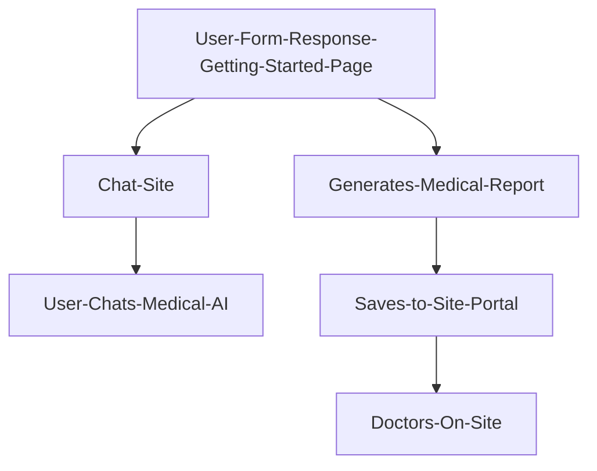
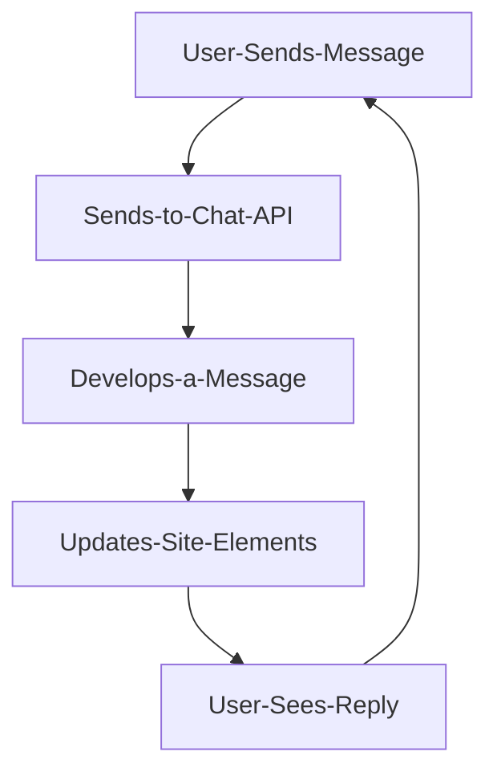
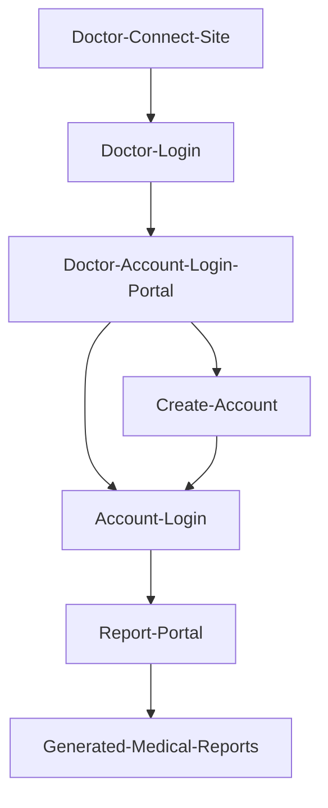
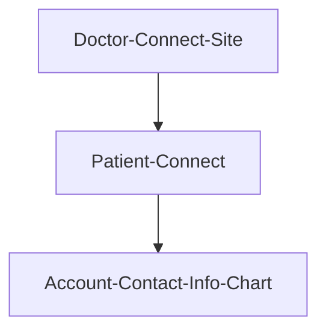

# **TheraAIassitant: Virtual Med Assitant**
### Gemini API Included [Flask, HTML5 Build]

[TheraAIassitant Site](https://eshams28.pythonanywhere.com)

# **Website Exploration**
#### In depth of the web-application

_______________________________________________________________________________________________________________

###### *About Section:* 

[About/Home Section of Website](https://eshams28.pythonanywhere.com/home)

A complete website application built with purpose to translate, store, send, and present medical information, advice, and generated reports from patient, user, or doctor, to present a clearer diagnosis, at a faster efficiency, including specifics such as required medication (dosages), lifestyle modifications, and possible discussion help with patients. 

> [!TIP]
> Check out the promotional video → [#builtwithgemini](https://youtu.be/hTcykSfz-d4)
>  Youtube Video Name: **TheraAI Demo :: Built with Gemini AI**

Integratated medical report generation that can be linked, and utilized in-browser tab, file download & retrieval, includes in-site chat-assitant avaibility for specific patients (upon submitting the symptom form). 

Includes opportunities for patients to connect with doctors registered on the site, and for doctors to have a virtual assistant, and accessible environment for collecting data. 

*Private* :: *Personalized* :: *Priceless* 
_______________________________________________________________________________________________________________

###### *Mission* 
*An online web-app dedicated to providing others, and option for free, accessible, personalized, and efficient health-advice, and healthcare.*

Struggling Issues of Healthcare and Provider Avaibility in the US and World: 

> *"—In 2020, 31.6 million (9.7%) people of all ages were uninsured. . .This includes 31.2 million (11.5%) people under age 65. Among 
children, 3.7 million (5.0%) were uninsured, and among working-age adults (aged 
18–64), 27.5 million (13.9%) were uninsured."*
> [National Health Statistics Report 2022 #169](https://www.cdc.gov/nchs/data/nhsr/nhsr169.pdf#:~:text=Results%E2%80%94In%202020%2C%2031.6%20million%20%289.7%25%29%20people%20of%20all,adults%20%28aged%2018%E2%80%9364%29%2C%2027.5%20million%20%2813.9%25%29%20were%20uninsured.)

>*"In 2023, the national average was 9.1 percent. White Americans had a below-average rate of just 5.8 percent, whereas 8.6 percent of Black Americans had no health insurance. Including 19% of Hispanics, and 3.9% of non-hispanic Asians."*
> [Percentage of people in the U.S. without health insurance by ethnicity 2010-2023 || Statista](https://www.statista.com/statistics/200970/percentage-of-americans-without-health-insurance-by-race-ethnicity/)

>*"At least 4.5 billion people – more than half the world’s population – are not fully covered by essential health services, according to 2021 data."*
> *"Access to basis healthcare caused financial hardship for nearly two billion people, while over 1.3 billion were pushed back or pushed deeper into poverty just trying to access basic services and medicines – a stark reality of widening health inequities, according to WHO."*
> [United Nations Global Perspective Healthcare](https://news.un.org/en/story/2023/09/1141202)
_______________________________________________________________________________________________________________

###### *Getting Started Page* 
[Getting Started Page of Website](https://eshams28.pythonanywhere.com)
 

Starting on the main page, patients, or doctors, can enter info about the patient (symptoms, etc) in a form, which will then be sent; prompting the creation of a medical report generated by the API-model (the report also includes specific instruction to medication, dosage, lifestyle, and reasoning).

Special Capabilties: Can generate messages in languages (supported by the Google-Generative Library :: Most Languages containing type-set characters), generate messages in a shorter format, simply, or focus on specific categorical information statements if the user requests it.

> [!TIP]
> Link to HTML Page File: ["Getting Started"](templates/index.html)

Any specific information such as weight, height, age, and gender is completely anonymous, and will service the AI in generating a more accurate, and conditioned report. And will not referenced in any report of any tracking information, network information, etc.

Once submitted the form will send a request with your responses, allowing the AI model to generate an example medical report, in which you can access with a doctor's account on the site. Furthermore, after submitting the form, you will be taken to another page in the site, where you can chat with the AI to get any further medical anwer you may have with your situation. 

Sequence of WebAction:

_______________________________________________________________________________________________________________

###### *Chat Page* 

Special Capabilties: Can generate messages in languages (supported by the Google-Generative Library :: Most Languages containing type-set characters), generate messages in a shorter format or simply statements if the user requests it. 

Here, read the chat messages sent by the chat-generation model. You can enter a message below, and press the send button, and wait for the response to appear in the message area directly under the Chat Assistant title. To start the conversation, type and send a message, “I need help”, and proceed to wait 1-2 minutes for any message/response to be printed by the model. 

Answer any questions, follow through with any of the responses the model will send back to you as the patient or the doctor. Answer and message back and forth for a couple of messages between the Chat-assistant, viewing its element of service, medical advice/help, or analysis throughout your personalized healthcare journey. The AI may give suggestions, or resources to connect to other health professionals. 

> [!TIP]
> Link to HTML Page File: ["Chat Page"](templates/chat.html)

To leave the chat, type & send, “I am satisfied with my care”. And tap out of that page, by either accessing or going back to “Home”, “Getting Started”, or “Doctor Connect+” 

Sequence of WebAction:

###### *Doctor Connect+:*

Look at the main connection page, hover over the buttons “Doctor Login”, and “Patient Connect”, to get a better understanding of what they do, and where they take you in the website. Here in this page, doctors signed-up or logged in onto the site, can check out the anonymously generated medical reports (such as the one you did earlier in the “Getting Started Tab”) and can Login/or Sign Up with the Site. Patients or universal users on the site, can access the patient connect section, in which patients can look at the list of the doctors, and some of their work contact info entered on the site, in order to connect with them. 

#### *Doctor Login:* 

First, we can access the Doctor Login Site: 
Press the Doctor Login Button, you are now on the login page .. .
Here you can either use an already-created demo doctor account: 
*bob@gmail.com (enter email) bob (enter password)*
*red@gmail.com (enter email) red (enter password)*
And then press log-in 

OR 

You can create a test-doctor account (with pseudo names, emails, phone-numbers, locations, etc) DO NOT LINK ANY REAL EMAILS, as this database is for session-testing purposes, and the log-in and sign-up process is all internal not needing email verification, by pressing the create-account button (if you type in an email that already exists it will continue to reload the create-website, so use an email, that is not already been linked to an account on the site, this is for security purposes) 

After creating and logging in with the doctor account, you will be taken to the “Report Center” Page, where you will see all the anonymous API-model generated medical reports on the site, including the one you sent earlier when you were checking the “Getting Started Page”, look through the time-stamps and tap the links, in order to find your report, with your symptom conditions listed, and view what the AI had generated. You can further download the file in a text format to save on a device. 

After checking out the Doctor Contact, we can maneuver to the Patient Connect Page. 
Once again, press on the “Doctor Connect+” title on the navigation header, and make sure you are on the Connection Page, with the two buttons. 
Now press, the “Patient Connect” button.

#### *Patient Connection* 

Browse the Patient Connect Page, 
Here you can view the doctor accounts registered on the site, and helpful “professional/work” contact information to connect with one of those doctors for specific issues. You may see the account you created for the Doctor Portion of the testing phase. 

#### *Finale || Conclusion* 

After this, you may bounce around the site freely, utilizing and testing more medical prompts, and chat capabilities, as well as revisit our mission, in which to provide global, personalized, and accessible healthcare/advice to all people. 

# **Future Plans**

Future plans are to integrate with sites like MyChart, CVS Pharm +, and other office sites, to allow for virtual medical assistants (via Gemini and our Site), and greater support for patient care. 

# **Technical Documentation**
####  :trollface: Languages 

* **Python** *(Switching between dependencies and Versions)*
* **HTML5**
* **CSS** *(no bootstrap)*
* **JavaScript** *(Simple Script Templates)*
* **Jinja** *(asynchronous activity and web updates // Flask integration)*
* **C++** *(only library configuration or virtual env config)*

####  :trollface: Dependcies and Libraries 
> [!WARNING]
> All use of libraries require above Python 3.9, however, may have issues with the newest deployment of 3.12. This may change in the future

>[!CAUTION]
>The use of a flask or python deploying server, or app, will most-likely only have support for Python 3.10, as seen with using PythonAnywhere. Be aware of this when building your app, or using similar libraries and dependencies config.

* **Pyhon-3.10**
* **Python-3.12**
* **Flask, Flask-Python**
* **Flask-SQLAlchemy**
* **Google Generative AI**
* **Python-dotenv**

# **Credit**

Technical Description:
With a sequenced back-end (Flask_Python, Flask Database Mechanics, Asynchornous requests for JSON Data Objects, Login Sessions, Portal Exploration), front-end with main css (including animations/static actions), and HTML5 data Jinja(Flask) templates. 
